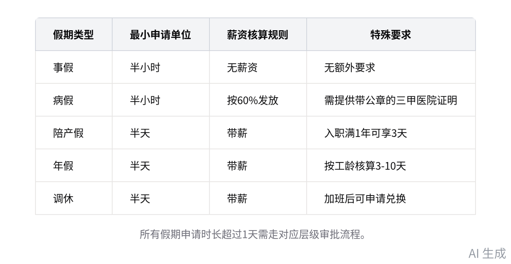

# 智能纪要：新员工入职相关制度讲解 2026年8月3日

录音主题：新员工入职相关制度讲解

录音时间：2026年8月3日（周一） 16:38 - 16:52 （GMT+08）

智能纪要由 AI 生成，可能不准确，请谨慎甄别后使用

## 总结

音频面向新员工开展入职行政规范宣讲，明确办公要求、考勤规则、福利标准等核心事项，内容如下：

- 核心红线与企业文化要求
  - 核心禁止行为：明确三类核心禁止行为，分别为滥用职权、拉帮结派、泄露公司机密，其余通用用人规则无需重点掌握。
  - 企业文化要求：企业文化内容印于员工手册第一页，核心仅需记忆前四字内容，要求员工熟读，后续将开展相关互动活动。
- 办公形象与工衣管理规范
  - 基础办公形象要求：日常办公形象以整洁为核心标准，无额外强制约束，除雨天可穿洞洞鞋外，其余时间建议穿着运动鞋。
  - 工衣全流程管理
    - 款式与发放规则：当前工衣为印小竹熊 logo 的黑白短袖，后续将视需求调整设计，适配深圳短冬季气候暂未设计长袖。
    - 申领与费用标准：入职 7 天左右按员工尺寸定制发放，每 2 年可免费申领一批，单件价格约三四十元，领用需签字确认。
    - 费用承担规则：入职未满半年离职需承担工衣费用的 60%，入职满一年离职则无需承担，额外采买提前报备即可。
    - 穿着执行要求：固定每周一、三、五穿着工衣，其余时间着装自由，遇工衣未干等特殊情况提前报备即可免穿。
- 工牌与考勤管理规则
  - 工牌管理要求：由行政统一制作，需员工提供电子照片，工牌佩戴无强制扣款要求，日常以提醒为主，离职需按规归还。
  - 考勤基础规则
    - 作息与打卡规则：执行大小周作息，早 9 晚 6，中午 12:30-14:00 为休息时间，应出勤按总天数减休息加补班核算。
    - 迟到核算标准：当月前三次 10 分钟以内迟到无惩罚且正常核算全勤，全勤标准为 100 元，超 4 次将扣减少量绩效。
    - 旷工认定规则：无故迟到超 1 小时视为旷工，有特殊情况提前或事后补报备即可，无正当理由旷工才会按制度处理。
  - 各类假期规则
- 请假申请要求：请假以半小时为最小申请单位，超过 1 天的需走对应层级审批，事假无薪资，病假需提供带公章的三甲医院证明。
- 带薪假期标准：入职满一年可享 3 天带薪陪产假，年假按对应工龄为 3-10 天不等，调休、年假均以半天为最小申请单位。
- 出差相关规则：赴义乌、澄海等地出差由行政统一预订合作酒店，有负责人同行的可由其统一提交申请，相关费用统一报销。

> 图片来源：飞书原始智能纪要；内容由 AI 生成，仅作为制度培训原始资料留存，具体制度以公司正式文件为准。

- 补卡执行规则：每月享有 5 次钉钉补卡机会，仅用于打卡故障等特殊场景，迟到无特殊情况不予走补卡流程。
- 固定资产管理说明：办公用电脑、笔记本等办公设备均属于公司固定资产，相关领用、保管的具体规则后续将另行告知。
