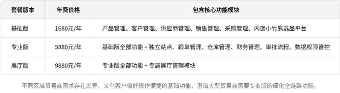

# 智能纪要：小竹熊与双引擎贸易系统培训 2026年8月3日

录音主题：小竹熊与双引擎贸易系统培训

录音时间：2026年8月3日（周一） 14:11 - 15:33 （GMT+08）

智能纪要由 AI 生成，可能不准确，请谨慎甄别后使用

## 总结

本次为玩具产业SaaS产品体系的入职专项培训，覆盖两大核心产品的逻辑、操作、政策等内容如下：

- 小竹熊选品平台核心体系
  - 平台定位与核心逻辑
    - 平台基础定位：为对接玩具贸易公司（买方）与玩具工厂（卖方）的垂直玩具行业SaaS信息整合平台，核心服务两类主体的核心业务诉求。
    - 行业底层逻辑：玩具产品仿制门槛极低，新品首发阶段利润空间最高，随着生产厂商增多价格会快速拉低，抢先布局新品即可赚取第一波高额利润。
    - 平台设计原则：所有功能模块均围绕贸易商快速找爆款、工厂精准获客的核心诉求设计，适配玩具行业的特殊业务规则与用户习惯。
  - 分端核心功能与优势
    - 贸易公司端核心功能：覆盖全量玩具厂资源选品、工厂线上对接、多币种智能报价、多语言独立站点四大核心模块，满足外贸全链路需求。
    - 贸易公司端核心优势：直连具备批量生产能力的源头工厂，覆盖澄海、义乌90%以上线下展厅，新品专区实时更新助力抢占爆款红利，平台功能对贸易商免费开放。
    - 玩具厂商端核心功能：覆盖一站式产品管理、专属代运营、产品刷新提曝光、来访大数据分析四大核心模块，降低厂商运营成本。
    - 玩具厂商端核心优势：垂直玩具赛道，曝光精准触达全量玩具贸易商，推广效率远高于1688、义乌购等综合类电商平台。
    - 玩具厂商端附加优势：提供免自主运营服务，由专属运营团队负责产品上下架、信息优化，适配澄海大量无专职运营人员的小作坊型工厂需求。
    - 玩具厂商端入驻优势：入驻仅需提供营业执照，后续由业务员上门核验生产线即可，门槛极低，基础会员年费远低于同类综合电商平台。
  - 平台操作规范指引
    - 贸易公司端选品操作：支持多维度筛选方式，包括空格分隔的多关键词搜索、支持上传Excel文件或Ctrl+V直接粘贴的以图搜款。
    - 贸易公司端选品操作：覆盖主题甄选、电商包、行业新品、资质认证、品牌、精选、主推、中文产品、视频的十大主题专区。
    - 贸易公司端选品操作：对应不同产业带优势品类的十大玩具产地筛选，其中行业新品专区为贸易商最高频使用的板块。
    - 贸易公司端选品规则：平台会为上线90天内的无重复产品打上新品标识，优先推荐给贸易商，帮助用户第一时间捕捉潜在爆款。
    - 贸易公司端对接操作：产品详情页直接展示工厂联系电话，同时支持线上咨询功能，行业用户更偏好直接电话沟通提升对接效率。
    - 贸易公司端报价操作：选品车选中产品后可导入已有报价单或快速新建，系统自动匹配实时汇率，导出为Excel后即可发给对应客户。
    - 贸易公司端站点操作：独立站点支持设置公有、私有两种访问权限，私有码站点仅可定向发给指定客户，避免价格信息泄露。
    - 贸易公司端站点操作：可自定义对应币种、汇率，支持多语言一键切换，适配不同国家外贸客户的访问习惯，是贸易公司非常偏好的功能。
    - 玩具厂商端产品操作：支持批量导入标准化模板上传产品，可绑定同系列不同颜色、型号的产品组合，设置最多6款主推产品置顶。
    - 玩具厂商端刷新操作：产品刷新为会员专属权益，本质类似闲鱼一键擦亮功能，可将产品排序前置提升曝光，操作前必须获得厂商明确授权。
    - 玩具厂商端刷新操作：支持设置自动刷新的时间节点，平台提供实时刷新热力板，厂商可参考贸易商上班高峰时段设置刷新时间。
    - 玩具厂商端数据操作：可在统计模块查看产品曝光、来访企业、行业热搜词等数据，为后续生产、选品方向提供数据支撑。
    - 玩具厂商端附加操作：可提交检测需求对接平台合作的万杰检测机构，也可通过玩具圈板块发布供需信息，对接上下游资源。
  - 厂商端会员套餐政策
    - 公开入驻套餐分为 3996 元/年、4996 元/年、5996 元/年三档，另有未公开的 2996 元/年档，用于引导业务人员向高客单价套餐转化。
    - 不同套餐核心差异为年度产品刷新次数、可上传产品库容量、是否赠送 APP 端高曝光广告位，额外可单独购买刷新次数增值包。
    - 销售可通过赠送额外刷新次数作为逼单手段，激励厂商提前续费或升级套餐，有效提升客户转化效率与整体客单价。
- 双引擎贸易管理系统核心体系
  - 系统定位与研发背景
    - 系统基础定位：面向玩具贸易公司的专属 ERP 管理系统，核心适配玩具贸易行业“先拿订单、反向采购”的特殊业务链条，实现全链路高效协同。
    - 研发核心动因：基于过往 6 年服务玩具贸易商的积累，大量客户反馈小竹熊仅覆盖选品环节，无法满足后续全链路业务管理需求。
    - 过往合作背景：此前平台与洪生 ERP 仅存在展厅产品数据互通的接口合作，即展厅上传至洪生的产品可直接同步至小竹熊，无需重复上传。
    - 当前迭代状态：双方终止合作后，结合自身开发能力与客户明确需求启动自研，当前已有一批存量种子客户在等待产品功能完善，迭代优先级较高。
  - 核心业务模块逻辑
    - 前端选品模块：直接内嵌小竹熊选品平台，贸易商无需跳转即可完成找品、产品信息同步，打通选品到内部管理的全链路数据。
    - 核心业务模块：覆盖销售管理、采购管理、跟单管理、排柜拼柜、仓库管理、财务管理全链路功能，适配玩具贸易的全流程需求。
    - 采购模块特殊规则：支持将单个订单拆分配发给多个工厂生产，适配单工厂产能不足的行业常见场景，提升订单交付效率。
    - 仓库模块特殊规则：支持按需选择采购产品是否入库，适配贸易商直接从工厂装货出港的高频场景，减少中间周转成本。
    - 财务模块特殊规则：重点适配玩具行业应收/应付账款管理需求，支持工厂换单结算的特殊流程，匹配行业常规的账期结算规则。
    - 用户需求差异：不同区域贸易商需求存在差异，义乌贸易商要求操作更便捷，澄海大型贸易商要求功能更细化全面，迭代需兼顾两类需求。
  - 贸易商端会员套餐政策
    - 基础版（1680 元/年）：包含产品管理、客户管理、供应商管理、销售管理、采购管理、内嵌选品平台六大核心基础模块。
    - 专业版（5880 元/年）：在基础版功能之上，增加独立站点、跟单管理、仓库管理、财务管理、审批流程、数据权限管控功能。
    - 展厅版（9880 元/年）：在专业版功能之上，增加专属展厅管理模块，另有定制化开发、存储扩容等增值服务可按需选购。

> 图片来源：飞书原始智能纪要；内容由 AI 生成，仅作为培训原始资料留存。

- 培训后续安排
  - 考核相关安排：培训结束后将发放开卷选择题考试链接，所有考题均来自本次培训覆盖的知识点，作答过程中可对照平台、系统操作验证答案。
  - 产品实操安排
    - 双引擎贸易系统将由工作人员发放专属测试账号，产品岗可自行摸索各模块的业务逻辑与上下游衔接规则，无需逐一讲解。
    - 若操作过程中存在疑问，或需了解系统当前迭代进度，可直接对接相关负责人获取最新信息，避免信息差影响产品规划。

## 待办

- [ ] 下载模板报错跟进：核实工厂端产品管理模块点击下载导入模板时出现报错的问题，排查是否为培训账号导致的异常并反馈处理
