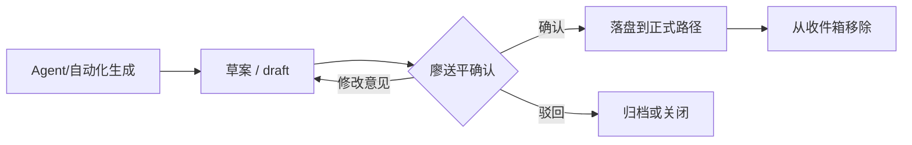
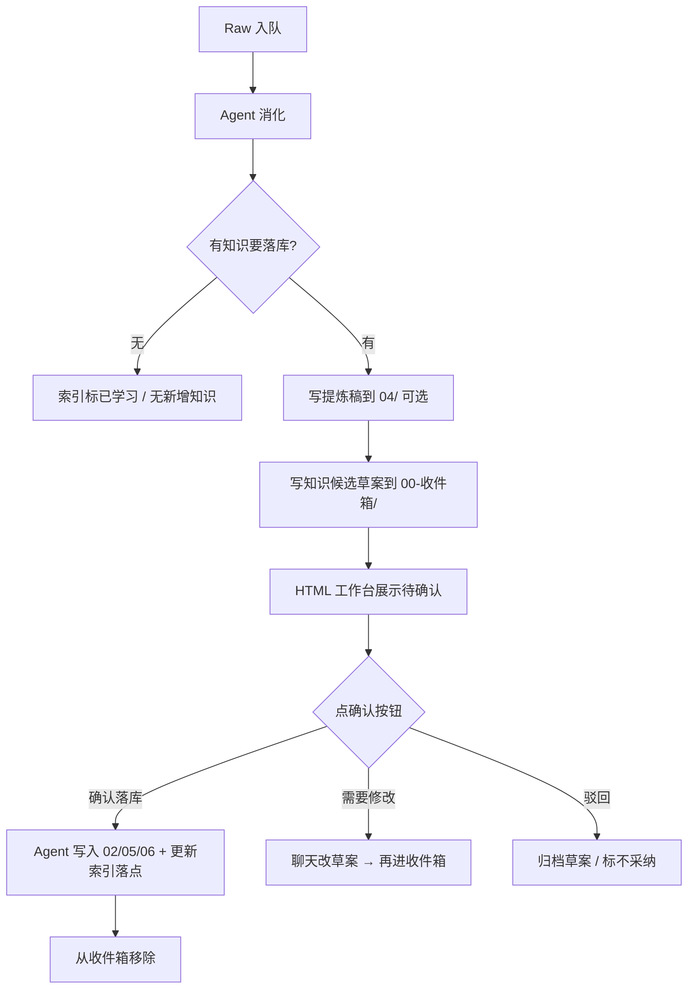

# Agent聊天-Cursor-我想基于现在的工作空间，搭建一个可视化的工作台，使用的场景：比如需要我确认的草稿

> 以下内容由本机 agent-chat-bridge 从会话落盘文件转换。已剥离工具调用与系统提示，并做基础脱敏。属于未验证原始材料。

## 用户

我想基于现在的工作空间，搭建一个可视化的工作台，使用的场景：比如需要我确认的草稿状态的内容，等等，为此你有什么更好的想法吗

## 助手

先了解你当前工作空间的结构与协作方式，再据此给出可视化工作台的设计思路。

[REDACTED]

## 助手

[REDACTED]

## 助手

[REDACTED]

## 助手

[REDACTED]

## 助手

[REDACTED]

## 助手

[REDACTED]

## 助手

基于你现有工作空间的结构，我的核心判断是：**你缺的不是又一个「今日工作台 Markdown」，而是一个「确认收件箱 + 状态聚合视图」**。

下面按「问题 → 设计思路 → 分期方案 → 待你拍板的边界」展开。

---

## 1. 当前缺口在哪里

你的工作空间其实已经有很完整的**数据层**，但**待你处理的事项分散在多处、且很多「草稿」只存在于聊天里**：

| 类型 | 现状 | 可视化难点 |
|---|---|---|
| 工作日报草案 | 协作偏好要求「确认后落盘」，草案多在 Agent 聊天里 | 无持久文件 → 无法列表化、无法挂 badge |
| Raw 消化 | 索引有「未学习/部分学习」；`raw-state.json` 有队列 | 需打开 Raw README 或 runtime 文件 |
| 待确认问题 | `06-长期记忆/待确认问题.md` 大表 | 与「今日待办」割裂 |
| 阻塞 / 等待反馈 | 分散在 `今日工作台.md` 与 `agent切换交接文档.md` | 两处维护，易漏 |
| 知识候选 | 自动消化写「待验证」；「落库前确认」尚在决策中 | 没有统一的「待你批注」卡片 |
| 需求 / PRD | 需求池 + frontmatter `status` | 与收件箱未打通 |

`今日工作台.md` 的 YAML 已是 `type: dashboard`，但它是**人工维护的 Markdown 仪表盘**，不是**从全库扫描生成的可视化层**。

---

## 2. 建议的核心概念：「确认收件箱」

与其做「大而全的项目管理系统」，不如先做你描述的场景——**「需要我确认的草稿」**——并把它做成工作台的**第一优先级区域**。

### 统一状态机（建议）

所有「等你拍板」的内容，都走同一套生命周期：



### 建议新增的物理位置（概念层，非必须立刻建）

```
00-收件箱/
  待确认/
    工作日报/
    知识候选/
    协作偏好/
    决策草案/
  _index.yaml          # 机器可读索引（可选，见下）
```

**关键规则**（与现有协作偏好对齐）：

- **草案必须先落文件，再发你确认**——不要只停在聊天里（8/7 日报补写就是典型：多轮草案全在 Raw 聊天里，工作台看不见）。
- 正式落盘后，草案移入 `99-归档/收件箱/` 或标记 `status: 已确认`。
- Markdown 仍是权威源；HTML 工作台只是**只读聚合 + 跳转 + 轻量操作入口**。

### 收件箱应聚合的 6 类事项

1. **归档文稿草案**：工作日报对内/对外、周复盘  
2. **知识落库草案**：课程/会议消化后的「待落库版本」（RAW-008 已验证过的流程）  
3. **协作偏好 / 决策草案**：如「知识落库前须确认」边界决策  
4. **Raw 待消化**：索引「未学习」+ `digest-engine` 为 `session-agent` 时的队列  
5. **高影响待确认问题**：Q 表中「待确认 / 部分确认」且负责人含你  
6. **产品草稿**：PRD `status: 草稿`、需求「待澄清」

---

## 3. 可视化工作台的信息架构（四区布局）

```
┌─────────────────────────────────────────────────────────┐
│  顶栏：今日三重点 │ 待确认(5) │ 未消化Raw(6) │ 阻塞(3)   │
├──────────────┬──────────────────────┬───────────────────┤
│ ① 确认收件箱  │  ② 今日执行           │  ③ 上下文         │
│ （必须动作）  │  四象限 / 进行中需求   │  阻塞 / 等待反馈   │
│              │  今日会议             │  本周学习重点      │
├──────────────┴──────────────────────┴───────────────────┤
│  ④ 系统健康：自动化任务 │ Raw 流水线 │ 最近 Agent 交接    │
└─────────────────────────────────────────────────────────┘
```

**设计原则**：

- **左栏只做「需要你动作的事」**——打开就能批，不要和「了解态信息」混在一起。  
- **阻塞 / 等待反馈**保留在工作台，但**权威条目只维护一处**（建议仍以 `今日工作台.md` 为准，交接文档只链过去）。  
- **对外 / 对内日报**在收件箱里成对展示，符合你双轨偏好。

---

## 4. 技术路线：三档，符合你的 MVP 原则

### 方案 A — 最小可行（推荐先做）

**静态 HTML + 生成脚本**，贴合 README 里「Markdown 底座 + HTML 低保真原型」。

- 新增 `工作台.html`（或 `03-产品工作/工作台/index.html`）
- 脚本 `08-自动化/build-dashboard.mjs` 扫描：
  - `00-收件箱/待确认/**` 的 frontmatter
  - Raw 索引表（解析 README 表格）
  - `06-长期记忆/待确认问题.md` 表格
  - `今日工作台.md` 各节
  - `08-自动化/.runtime/raw-state.json`
- 输出 `08-自动化/.runtime/dashboard.json` + 渲染 HTML
- **触发**：Raw 入队后、日报生成后、手动 `npm run dashboard`

**优点**：零后端、本地打开、与 Git 工作流一致；Agent 写草案文件后刷新即可见。  
**缺点**：确认动作仍回 Cursor/聊天，或点链接打开 Markdown 编辑。

### 方案 B — 半交互（第二阶段）

在 HTML 里加：

- 按类型筛选（日报 / 知识 / Raw / Q）
- 预览 Markdown（客户端 marked.js）
- 「复制确认口令」按钮（如生成「确认落盘 2026-08-08-工作日报」供 Agent 执行）

仍不改权威源，只是把**确认动作标准化**。

### 方案 C — 飞书 / 妙搭（按需）

若你希望**手机也能批**、或推飞书卡片提醒：

- 用妙搭做只读仪表盘 + Webhook 收「确认」
- 确认后 Agent 仍写回工作空间 Markdown

**建议**：入职熟悉期先用 A，别过早上 C。

---

## 5. 与「知识落库前须确认」决策的关系

工作台今日待办里已有这项决策。可视化能**把抽象偏好变成可操作队列**：

| 模式 | 收件箱表现 | 与 session-agent 关系 |
|---|---|---|
| **现状** | 候选知识直接进 `02-业务知识库/`（待验证） | 无确认队列 |
| **若扩成「凡落库都确认」** | 消化产出先进 `00-收件箱/待确认/知识候选/` | 与自动写入冲突，需改消化提示词 |
| **折中（推荐）** | 仅**高影响**进收件箱：新 SYS/KNOW、改已验证事实、协作偏好 | 普通「待验证」仍自动写，工作台用 badge 提示「新增 N 条待验证」 |

折中方案下，工作台左栏不会爆炸，同时保留你对重要知识的把关感。

---

## 6. 草案文件的 frontmatter 建议（统一扫描）

```yaml
---
title: 2026-08-08 工作日报（对内）
type: draft
category: 工作日报
status: 待确认          # 待确认 | 已确认 | 已驳回
target_path: 03-产品工作/工作日报/对内/2026-08-08-工作日报.md
source: cursor-automation
created: 2026-08-08
owner: 廖送平
---
```

`category` 枚举建议：`工作日报 | 知识候选 | 协作偏好 | 决策 | Raw消化 | 其他`  
这样生成器不用猜文件含义。

---

## 7. 不建议现阶段做的

- **不要做第二套待办系统**——你的偏好已是「待办默认落工作空间」，飞书任务仅明示时用；工作台应**链到** `今日工作台.md`，不替代它。  
- **不要把 Raw 原文搬进 UI**——只显示摘要 + 链接，保持 Raw 不可改原则。  
- **不要实时双向同步 Obsidian/Notion**——增加权威源分裂风险。  
- **不要一开始就做「在工作台里点确认就自动 git commit」**——确认仍走 Agent + 你的协作偏好更安全。

---

## 8. 若只做一件事：改日报流程

投入产出比最高的一步：

> **18:00 自动化生成日报后，写入 `00-收件箱/待确认/工作日报/YYYY-MM-DD-{对内|对外}.md`，再通知你；确认后才移到正式目录。**

这一条 alone 就能让「可视化工作台」有第一个稳定数据源，且与现有协作偏好完全一致。

---

## 9. 需要你拍板的 3 个问题

1. **确认动作发生在哪里？**  
   - A：仍在 Cursor 聊天说「确认」  
   - B：工作台 HTML 里点按钮（实质仍是生成口令给 Agent）  
   - C：飞书卡片  

2. **知识落库边界**选哪种？  
   - 全确认 / 仅高影响 / 维持现状 + 仅提示  

3. **工作台载体**？  
   - 本地 HTML（推荐）  
   - Cursor Canvas（适合单次分析，不适合日常入口）  
   - 妙搭应用（要移动端再加）  

---

**总结**：最好的可视化工作台不是重做 PM 工具，而是 **`Markdown 权威源 + 统一「待确认」目录 + 聚合视图`**。先解决「草案只在聊天里看不见」的问题，再逐步把 Raw 队列、待确认 Q、阻塞项收进同一屏。

你更倾向 **方案 A 本地 HTML**，还是 **顺带要飞书/mobile 能力**？以及「知识落库前确认」想走**折中还是全确认**？确定后我可以帮你拆一版具体的目录结构、frontmatter 规范和第一屏线框（Ask 模式下仅方案；要落地可切 Agent 模式）。

[REDACTED]

## 用户

```chat_selection
agent_id: 86ff74a4-77ca-464f-9b01-fd1e8c1bc92f
selected_text:
确认动作发生在哪里？

A：仍在 Cursor 聊天说「确认」
B：工作台 HTML 里点按钮（实质仍是生成口令给 Agent）
C：飞书卡片
```
 B

```chat_selection
agent_id: 86ff74a4-77ca-464f-9b01-fd1e8c1bc92f
selected_text:
知识落库边界选哪种？

全确认 / 仅高影响 / 维持现状 + 仅提示
```
 没理解你的问题，你详细解释一下
 
```chat_selection
agent_id: 86ff74a4-77ca-464f-9b01-fd1e8c1bc92f
selected_text:
工作台载体？

本地 HTML（推荐）
Cursor Canvas（适合单次分析，不适合日常入口）
妙搭应用（要移动端再加）
```
 本地HTML

## 助手

你选了 **B（本地 HTML 点按钮确认）** 和 **本地 HTML 载体**。下面专门把「知识落库边界」讲清楚——这是工作台要扫哪些「待确认」项的核心规则。

[REDACTED]

## 助手

好的，你的选择可以记为：

- **确认方式**：B — 本地 HTML 里点按钮（实质是给 Agent 一条标准口令）
- **载体**：本地 HTML

下面专门解释「知识落库边界」——它决定：**Agent 消化 Raw 后，哪些东西必须先出现在工作台的「待确认」里，你才能点按钮批准写入。**

---

## 「知识落库」指的是什么

在你这套工作空间里，「落库」不是泛指写任何文件，而是特指：**把内容写进长期沉淀区**，主要包括：

| 落库目标 | 示例 |
|---|---|
| `02-业务知识库/` | 双引鲸模块页、KNOW/SYS 档案 |
| `06-长期记忆/` | 协作偏好、待确认问题 Q-xxx |
| `05-决策记录/` | 正式决策 |
| `03-产品工作/` 正式稿 | 已确认的工作日报、PRD |

与之对比：

- **Raw 原文**：采集进来，一般不让你逐条确认
- **提炼稿**（`04-会议与调研/`）：Agent 消化时自动写，目前也**不需要**你先确认
- **草案 / 收件箱**（若新建 `00-收件箱/`）：专门放「等你点按钮」的内容

所以这个问题问的是：**Agent 消化完 Raw 之后，写 `02/`、`06/` 等目录时，要不要先停在你这边的确认队列里？**

---

## 为什么现在会有三种选项

你工作空间里其实并存两套规则，略有不一致：

**规则 A（已在协作偏好里）**  
> 自动消化**可以**写「待验证知识、观点、推测、待确认问题」，**不能**写「已验证事实」。

也就是说：消化 `RAW-20260806-001` 后，Agent **已经可以直接**更新双引鲸模块页，只是标成「待验证」。

**规则 B（你在 RAW-008 / 玩具产业课程里实践过的）**  
> 生成知识库**前先让你确认**；你说「确认落库」后才写入。

**规则 C（工作日报，你已定型）**  
> 生成草案 → 你确认 → 才落盘。

工作台待办里那条「是否补充知识落库前须确认」，就是在问：**规则 B 要不要推广成全局规则？推广到什么程度？**

---

## 三种边界，用你真实场景举例

### 选项 1：全确认

**含义**：凡是写进 `02-业务知识库/` 或 `06-长期记忆/`（改偏好、加 Q）的，都**不能直接写**；Agent 只产出草案到 `00-收件箱/待确认/知识候选/`，你在 HTML 点「确认落库」后才写入。

**例子**：

- 新妙记进来 → Agent 消化 → 产出《双引鲸审批流-候选知识草案.md》→ 工作台显示 1 条待确认 → 你点按钮 → 才更新 `模块/03-审批流.md`

**优点**：每条知识你都看过，工作台「待确认」最完整。  
**缺点**：Raw 一多，收件箱会爆；与现在 `session-agent`「会话里消化完就写待验证」的流程**正面冲突**，消化提示词、流水线都要改。

**适合**：你希望知识库增长完全人工把关，不介意消化变慢。

---

### 选项 2：仅高影响确认（折中）

**含义**：**大部分**仍按现状——Agent 自动写「待验证」进知识库；**只有一类**先进收件箱，等你点按钮：

建议的高影响清单（可微调）：

| 类型 | 是否进收件箱 | 例子 |
|---|---|---|
| 新建 SYS/KNOW 主档案 | 是 | 新建 `KNOW-202608xx-xxx.md` |
| 修改已有条目的「已验证事实」段落 | 是 | 把某条从待验证升为已验证 |
| 写入 / 修改 `协作偏好.md` | 是 | 新增强制规则 |
| 新增 DEC 决策记录 | 是 | 产品方向决策 |
| 更新已有模块页的待验证段落 | 否（自动写） | RAW-006 更新双引鲸审批流模块 |
| 新增 Q-xxx 到待确认问题 | 否（自动写） | 消化会议时自动加 Q-039 |
| 只写提炼稿、不改知识库 | 否 | 无新增知识的 Agent 聊天 |

**例子（同一条 RAW-20260806-001）**：

- 更新 `模块/03-审批流.md` 的待验证内容 → **自动写**，工作台只显示 badge：「今日新增 3 条待验证知识（可稍后浏览）」
- 若 Agent 想新建 `SYS-20260808-002-新系统.md` → **进收件箱**，必须你点按钮

**优点**：收件箱不会淹没；重要变更仍把关；和现有 session-agent 大体兼容。  
**缺点**：要维护一张「什么算高影响」清单。

**适合**：你既要可视化确认，又不想每条模块小改都点一次。**我个人仍倾向这个**，但取决于你的偏好。

---

### 选项 3：维持现状 + 仅提示

**含义**：知识库**继续全自动写**（待验证）；工作台**不**把知识放进「待确认收件箱」，只在仪表盘上提示，例如：

> 「本周自动新增 12 条待验证知识 · 6 条待确认问题 · 点击查看」

**例子**：

- RAW 消化完 → 模块页已更新 → 工作台无待办项，只有统计数字
- 工作日报草案 → **仍进收件箱**（因为你已选定 B，且日报规则独立）

**优点**：零流程改动，工作台先做日报/决策类确认即可。  
**缺点**：没有解决 RAW-008 里「课程消化前先确认」那类诉求；知识库变大了你可能不知道 Agent 写了什么。

**适合**：现阶段只想解决「日报等归档文稿确认」，知识库先信任 Agent 的待验证写入。

---

## 和「确认方式 B + 本地 HTML」怎么配合

你选了 **HTML 点按钮**，知识边界只影响**按钮队列里会出现什么**：

```
┌─ 待确认收件箱（必须点按钮）──────────────┐
│  · 工作日报对内/对外草案          ← 三种边界都有 │
│  · 协作偏好 / 决策草案            ← 三种边界都有 │
│  · 知识候选草案                  ← 看边界选项     │
└────────────────────────────────────────┘

┌─ 仅浏览区（不用点按钮，可选查看）────────┐
│  · 本周新增待验证知识列表          ← 选项2/3  │
│  · 未消化 Raw                     ← 三种都有 │
│  · 待确认问题 Q 表                  ← 三种都有 │
└────────────────────────────────────────┘
```

**按钮 B 的实际行为**（本地 HTML，无后端）：

1. 每条待确认项旁有「确认落库」「需要修改」
2. 点「确认落库」→ 复制一条标准口令到剪贴板，例如：  
   `确认落库：00-收件箱/待确认/工作日报/2026-08-08-对内.md`
3. 你在 Cursor 粘贴发送 → Agent 按协作偏好执行：写入正式路径、归档草案、更新工作台

这样 HTML 负责**看见 + 一键生成口令**，权威写入仍由 Agent 完成，符合 Markdown 唯一权威源。

---

## 帮你对齐决策：其实只需回答一个问题

不用先记「全确认 / 高影响 / 维持现状」这些词，核心就一句：

> **Agent 消化 Raw 后自动更新双引鲸模块页、加 Q-xxx 这类「待验证」内容时，你要不要先在工作台里点一次按钮？**

| 你的回答 | 对应选项 |
|---|---|
| **要，每一条知识写入前都要我批准** | 全确认 |
| **不要，小改自动写；只有新建档案、改偏好、升已验证事实才要我批** | 仅高影响 |
| **不要，知识库全自动；工作台只管日报和少数文稿** | 维持现状 + 仅提示 |

---

## 建议的默认路径（若你暂时不想深想）

结合你当前阶段（大量 Raw、session-agent、双引鲸模块页已在自动增长）：

1. **先做**：工作日报 + 协作偏好/决策 → 进 HTML 待确认（三种边界都一样）
2. **知识库**：先用 **「维持现状 + 仅提示」** 或 **「仅高影响」**，不要一上来 **全确认**
3. 跑 1–2 周后看收件箱量和漏看情况，再决定是否把「课程类消化」单独加成必确认

---

你回复上面表格里三选一（或用自己的话描述），我可以下一步给你一版**本地 HTML 工作台的具体页面结构 + 按钮文案 + 扫描规则清单**（仍保持 Ask 模式只出方案；要落地实现再切 Agent 模式）。

[REDACTED]

## 用户

但凡从raw学习完，有知识要落库的内容都需要我确认

## 助手

你这句话等价于选了 **「Raw 消化 → 凡涉及知识落库，一律先确认」**（比之前说的「全确认」更清楚）。下面按这条规则，把边界、流程和工作台怎么配合说清楚。

---

## 你的规则（一句话）

> **Raw 学习完成后，只要 Agent 打算把内容写进知识沉淀区（而不只是记「无新增知识」），就必须先出草案 → 你在本地 HTML 工作台点确认 → 才允许落库。**

这和现在的差异很大：现行协作偏好允许 Agent **直接写「待验证」进 `02-业务知识库/`**，无需你批准。你要改成：**待验证也不行，得先过你这一关。**

---

## 建议先划清「什么算知识落库」

否则 Agent 会在边界上扯皮。建议写成下面这张表（你认可后可进协作偏好）：

| 动作 | 是否要你确认 | 说明 |
|---|---|---|
| 新建/更新 `02-业务知识库/**` | **是** | KNOW、SYS、双引鲸模块页、术语表等 |
| 新建/更新 `06-长期记忆/待确认问题.md`（新增 Q） | **是** | 属于知识沉淀 |
| 更新 `06-长期记忆/协作偏好.md` / 工作档案 | **是** | 若来源是该条 Raw 消化 |
| 新建 `05-决策记录/**` | **是** | |
| 新建/更新 `04-会议与调研/*-提炼.md` | **建议否** | 提炼稿是「消化中间产物」，方便你审阅草案时对照；若也确认，收件箱会多一倍文件 |
| 更新 Raw 索引（学习状态、知识库落点、摘要） | **否** | 流水线元数据，确认后由 Agent 一并更新 |
| 写 `00-收件箱/待确认/知识候选/**` 草案 | **否** | 这就是等你确认的东西 |
| 更新 `今日工作台.md` / `agent切换交接文档.md` | **建议否** | 操作型同步；或在「确认落库」一步顺带更新 |

**核心**：收件箱里应是 **「拟写入 02/05/06 的内容」**；提炼稿可自动写，作为你点按钮前的阅读材料。

---

## 新流程（Raw 消化）



和 **8/4 玩具产业课程**（RAW-008）的流程一致，只是从「偶尔手动」变成 **每条 Raw 有落库内容都走**。

---

## 本地 HTML 工作台（你选的 B）怎么配合

### 收件箱卡片示例

每条 Raw 消化产生的「知识候选」一张卡：

```
┌─────────────────────────────────────────────┐
│ 📚 知识候选 · RAW-20260806-001              │
│ 主题：贸易公司系统功能讲解与讨论              │
│ 拟落库：                                     │
│   · 02/.../模块/03-审批流.md（更新）          │
│   · 02/.../模块/05-单据主链路.md（更新）      │
│   · 06/.../待确认问题.md（+Q-032—Q-038）    │
│ 对照：[打开提炼稿] [打开草案预览]            │
│ [确认落库] [需要修改] [驳回]                 │
└─────────────────────────────────────────────┘
```

### 三个按钮生成的口令（粘贴到 Cursor）

| 按钮 | 复制到剪贴板的口令示例 |
|---|---|
| **确认落库** | `确认落库：00-收件箱/待确认/知识候选/RAW-20260806-001-知识候选.md` |
| **需要修改** | `修改知识候选：RAW-20260806-001，意见：……` |
| **驳回** | `驳回知识候选：RAW-20260806-001，原因：……` |

Agent 收到「确认落库」后应：读草案 → 写入正式路径 → 更新 Raw 索引「知识库落点」→ 草案移入归档 → 工作台刷新后该条消失。

工作日报等待确认项仍用同一套按钮逻辑，只是 `category` 不同。

---

## 和现有规则冲突的地方（落地时要改）

| 现状 | 你要的 |
|---|---|
| 协作偏好：自动消化**可写**待验证知识 | 改为：**禁止**直写 02/05/06，只能写收件箱草案 |
| `session-agent` 消化提示词：直接更新知识库 | 改为：产出 `00-收件箱/待确认/知识候选/` |
| Raw 索引「知识库落点」在消化完成时即填 | 改为：确认前写「待确认：`00-收件箱/...`」；确认后再填正式落点 |
| 今日工作台待办：「是否补充知识落库前须确认」 | 你已决策：**要**，且范围是 **凡 Raw 落库知识** |

**注意**：未消化 Raw（索引「未学习」）仍由 Agent 在会话里消化，但消化结果**不能**直接进 `02/`——这是流程上最大的改动。

---

## 草案文件建议格式（供扫描器读）

```yaml
---
title: RAW-20260806-001 知识落库候选
type: draft
category: 知识候选
status: 待确认
raw_id: RAW-20260806-001
source_raw: 01-原始文件（Raw）/2026-08-06-贸易公司系统功能讲解与讨论.md
extract: 04-会议与调研/RAW-20260806-001-贸易公司系统功能讲解与讨论-提炼.md
targets:
  - path: 02-业务知识库/系统与流程/双引鲸ERP/模块/03-审批流.md
    action: update
  - path: 06-长期记忆/待确认问题.md
    action: append
owner: 廖送平
created: 2026-08-08
---
```

正文：拟写入各文件的**完整内容**或清晰 diff 说明，方便你在 HTML 里预览后再点按钮。

---

## 实际影响（心里有数）

1. **收件箱会变多**：每条有落库的 Raw 至少 1 张卡；双引鲸密集学习期可能一天多条。  
2. **消化 ≠ 落库**：Agent 消化完会停在你这边，索引可以是「已评估待确认」之类中间态（若要可加第四态，或仍用「部分学习」表示草案在收件箱）。  
3. **历史已落库的不回溯**：`RAW-20260806-001` 等已写入模块页的，不必搬进收件箱；**从新 Raw 或「部分学习」重消化起**适用新规则。  
4. **聊天类 Raw**：若消化会改协作偏好/候选知识，同样先进收件箱——和「临时指令不写长期偏好」不矛盾，只是**写入前**多一道确认。

---

## 已拍板汇总（供后续实现）

| 项 | 你的选择 |
|---|---|
| 确认方式 | HTML 点按钮 → 复制口令 → Cursor 发给 Agent |
| 载体 | 本地 HTML + 生成脚本 |
| 知识落库边界 | **凡 Raw 学习完、有知识要落库 → 必须先确认** |
| 提炼稿 | 建议仍自动写 `04/`，仅 02/05/06 进收件箱 |
| 工作日报 | 继续进收件箱（与知识候选并列） |

---

若你认可「提炼稿自动写、仅 02/05/06 进收件箱」这条细分，下一步在 **Agent 模式**下可以按顺序做：建 `00-收件箱/` 结构 → 改消化提示词与协作偏好 → 写 `build-dashboard.mjs` + `工作台.html`。需要我先出一版**目录树 + 页面线框 + 提示词改动清单**（仍不写代码）也可以说一声。

[REDACTED]

## 用户

```chat_selection
agent_id: 86ff74a4-77ca-464f-9b01-fd1e8c1bc92f
selected_text:
00-收件箱
```
 这个收件箱的名字能不能换一个，感觉不是很贴切

```chat_selection
agent_id: 86ff74a4-77ca-464f-9b01-fd1e8c1bc92f
selected_text:
今日工作台待办：「是否补充知识落库前须确认」
```
 这部分是不是也可做进本地的HTML工作台里去

## 助手

两个问题分开说：**文件夹叫什么更合适**，以及**「是否补充知识落库前须确认」还要不要单独做进 HTML**。

---

## 1. 不叫「收件箱」——换什么更贴切

「收件箱」容易和 **`01-原始文件（Raw）`** 混淆：Raw 才是**资料入口**；你要建的目录是 **Agent 产出、等你拍板后才写入正式区** 的队列，更像「待批稿 / 待落库」，不是「刚收到的信」。

### 命名候选（按推荐度）

| 名称 | 含义 | 优点 | 缺点 |
|---|---|---|---|
| **`00-待确认区`** | 与「确认后落盘」「待确认问题」同一套词 | 好懂，和现有协作偏好一致 | 略宽，工作日报草案也适用 |
| **`00-落库确认`** | 强调：进 02/05/06 前须确认 | 和「知识落库」决策高度一致 | 工作日报路径不在 02，语义稍窄 |
| **`00-草案待审`** | 全是草案，等你审 | 和 PRD「草稿」、日报「草案」一致 | 「审」偏正式 |
| **`00-确认队列`** | 机器/流程感强 | 扫描脚本、HTML 标题好写 | 对产品同学略冷 |
| **`00-审阅区`** | 你在这里读一遍再批 | 语气自然 | 和「确认落库」动作关联弱一点 |

### 推荐

**首选：`00-待确认区`**

子目录可以这样分（名字也可再微调）：

```
00-待确认区/
  工作日报/
  知识候选/      ← Raw 消化拟落 02/05/06 的草案
  协作偏好/
  决策/
```

HTML 左栏标题用 **「待确认」**，和 `06-长期记忆/待确认问题.md` 的「待确认」是同一词族，但含义不同：

- **待确认问题**：业务上还不清楚的 Q
- **待确认区**：文稿/知识**已写好草案**，等你批准写入

若你希望文件夹名更贴「落库」动作，用 **`00-落库确认`** 也可以；工作日报可仍放其下，或在协作偏好里写一句「归档文稿统称待确认区内容」。

---

## 2. 「是否补充知识落库前须确认」要不要做进 HTML？

分两层：**这条待办本身**，和 **工作台该不该管这类事**。

### 这条待办：其实已经可以关掉

你在上一轮已经拍板：

> **但凡从 Raw 学习完，有知识要落库的内容都需要我确认。**

这就是工作台里那条「是否补充协作偏好」的答案——**要，且范围是凡 Raw 落库知识**。  
所以更准确的做法不是把它做成 HTML 里的一个永久卡片，而是：

1. **决策已做出** → 写入 `协作偏好.md`（及变更记录）
2. **今日工作台 对应待办勾选完成**
3. **HTML 体现的是执行层**：「知识候选」队列 + 确认按钮，而不是再问一遍「要不要这个规则」

### 那 HTML 里还要不要「决策类」内容？

**要，但是另一类东西**——

| 类型 | 是否进 HTML | 例子 |
|---|---|---|
| **已决策略的执行队列** | ✅ 核心 | 知识候选、工作日报草案 |
| **尚未拍板的策略问题** | ✅ 可选，小区域 | 「待决策：xxx」（类似现在工作台待办里那种） |
| **已拍板、只等写进偏好** | ❌ 不必常驻 | 「是否知识落库前确认」——你已答完 |

建议在 HTML 里加一块 **「待决策（≤3 条）」**，专门扫：

- `今日工作台.md` 里带 **「决策：」** 的待办
- 或 frontmatter `status: 待决定` 的决策记录草案

**没有待决策时整块隐藏**，避免和「待确认区」抢注意力。

### `今日工作台` 其它待办要不要进 HTML？

**建议要。** 和「知识落库确认」不同，这些是**日常执行待办**，适合放在 HTML **「今日执行」**区，例如：

- 任务四象限里未勾选项
- 「待办」节里的 `- [ ]` 项
- 可链回 Markdown，不必在 HTML 里编辑

结构可以是：

```
┌─ 待确认（必须点按钮）────── 来自 00-待确认区/
├─ 待决策（可选，少而精）──── 来自 今日工作台「决策：」
├─ 今日待办 ──────────────── 来自 今日工作台 待办/四象限
└─ 浏览：阻塞 / 等待反馈 / 未消化 Raw …
```

---

## 3. 和你已选方案的对齐

| 你的选择 | 在命名/HTML 上的落点 |
|---|---|
| 确认方式 B（HTML 点按钮） | 左栏 **「待确认」**，口令指向 `00-待确认区/...` |
| 本地 HTML | 扫描 `00-待确认区/` + `今日工作台.md` |
| Raw 落库全确认 | 子目录 **`知识候选/`**，不再单独问「要不要这条偏好」 |

---

**简短结论**：

1. **「收件箱」建议改为 `00-待确认区`**（或 `00-落库确认`）；Raw 仍是唯一资料入口，这里只放等你批准的草案。  
2. **「是否补充知识落库前须确认」不必做成 HTML 里的长期功能**——决策已定，HTML 做 **知识候选队列** 即可；其它 **未决「决策：」类待办** 可以单独做一小条「待决策」区。

你更倾向 **`00-待确认区`** 还是 **`00-落库确认`**？定名后，Agent 模式里可以按这个名字出目录树和 HTML 线框。

[REDACTED]

## 用户

1、把今日工作台也加进HTML中来，把带审阅的知识落库动作也视为一个待办事项；
2、 
```chat_selection
agent_id: 86ff74a4-77ca-464f-9b01-fd1e8c1bc92f
selected_text:
00-待确认区
```
 就叫这个把
3、这个HTML的名称叫：我的工作台，随便问下这个HTML的路径你打算放哪里

## 助手

可以，按你这三点把方案定稿如下。

---

## 已拍板

| 项 | 决定 |
|---|---|
| 草案目录 | **`00-待确认区/`**（下分 `工作日报/`、`知识候选/`、`协作偏好/`、`决策/`） |
| HTML 名称 | **「我的工作台」** |
| 内容范围 | 含 **今日工作台** 全文要点 + **知识落库审阅** 计入 **待办** |

---

## 1. 「今日工作台进 HTML」+ 审阅落库 = 待办

建议 HTML 里有一个统一的 **「待办」** 列表，来源合并，但用标签区分类型：

| 来源 | 在 HTML 里的呈现 | 类型标签 |
|---|---|---|
| `今日工作台.md` 里 `- [ ]`（三个重点、待办、四象限、下班前清理等） | 普通待办行，可跳转 Markdown | `常规` |
| `00-待确认区/知识候选/*.md`，`status: 待确认` | **每条算 1 项待办**，带「确认落库 / 需要修改 / 驳回」 | `审阅落库` |
| `00-待确认区/工作日报/*.md` | 同上（对内/对外可各算 1 项或合并 1 组） | `审阅归档` |
| `00-待确认区/` 下协作偏好、决策草案 | 同上 | `审阅决策` |
| Raw 索引「未学习」 | 可选：**「待 Agent 消化」**，不算你已点的待办，放「系统队列」区 | `消化队列` |

**顶栏计数示例**：

```
待办 8  （其中 审阅 3 · 常规 5）
```

「审阅落库」和「今日工作台 待办」**同一列表、不同标签**，避免左栏一套、中间又一套，找事要跑两处。

**今日工作台其余块**（不只待办）也进 HTML，作为 **「今日概览」** 只读展示：

- 三个重点（完成/未完成）
- 任务四象限（表格或四格）
- 活跃需求、阻塞、等待反馈、待确认问题摘要、本周学习重点  
- 每项链到对应 `.md`，**编辑仍在 Markdown**，HTML 不负责改权威源（除非你以后再加「复制口令让 Agent 改」）。

---

## 2. 路径建议：HTML 放哪里

结合你现有结构（根目录有 `今日工作台.md`，生成脚本在 `08-自动化/`），建议：

### 推荐（日常入口最好找）

```
D:\Apps\workspaces\xzx\
├── 今日工作台.md              ← 权威文本（Agent/你维护）
├── 我的工作台.html            ← 可视化入口（浏览器打开）
├── 00-待确认区/               ← 待审草案
└── 08-自动化/
    ├── build-workbench.mjs    ← 扫描 Markdown，生成 JSON
    └── .runtime/
        └── workbench.json     ← HTML 读取的数据（或内联进 HTML）
```

**理由**：

- 和 `今日工作台.md` **同级**，和 README「每天先打开今日工作台」习惯一致，只是多一个「浏览器版」。
- 文件名 **「我的工作台」** 与 `今日工作台` 区分开：前者是视图，后者是权威记录。
- 构建脚本放 `08-自动化/`，和 `raw-pipeline`、`digest-engine` 一类，不污染业务目录。

### 不推荐

| 路径 | 原因 |
|---|---|
| `00-待确认区/我的工作台.html` | 把「视图」和「草案存储」混在一个目录 |
| 仅放 `03-产品工作/` | 这是个人协作仪表盘，不是某个 REQ 产物 |
| 仅放 `08-自动化/` | 路径深，不方便每天双击打开 |

### 打开方式（实现时可做）

- 浏览器书签：`file:///D:/Apps/workspaces/xzx/我的工作台.html`
- 或在 `08-自动化/README.md` 写一行「生成后打开根目录 我的工作台.html」

---

## 3. 「我的工作台」页面结构（线框）

```
┌─ 我的工作台 ─────────────────────────────────────────┐
│ 2026-08-08 · 待办 8（审阅 3 · 常规 5）· 未消化 Raw 6  │
├──────────────────────────────────────────────────────┤
│ 【待办】                              [全部|审阅|常规] │
│  ☐ [审阅落库] RAW-20260807-004 知识候选  [确认][修改] │
│  ☐ [审阅归档] 2026-08-08 工作日报(对内)  [确认][修改] │
│  ☐ [常规] 复核双引鲸使用疑问…           → 今日工作台   │
│  …                                                   │
├──────────────────────────────────────────────────────┤
│ 【今日概览】← 来自 今日工作台.md                      │
│  三个重点 · 四象限 · 活跃需求 · 阻塞 · 等待反馈 …     │
├──────────────────────────────────────────────────────┤
│ 【队列】未消化 Raw · 自动化状态（可选）               │
└──────────────────────────────────────────────────────┘
```

按钮 **确认 / 需要修改 / 驳回**：复制口令到剪贴板 → 你在 Cursor 粘贴执行（你已选的 B）。

---

## 4. 和 `00-待确认区` 的目录关系（定名后）

```
00-待确认区/
  工作日报/
  知识候选/
  协作偏好/
  决策/
  README.md          ← 说明：仅草案，确认后 Agent 写入正式区并归档
```

`我的工作台.html` **不放在** `00-待确认区/` 里，只 **扫描** 该目录。

---

## 5. 实现顺序（供你切 Agent 模式时用）

1. 建 `00-待确认区/` 及子目录 + README  
2. 改协作偏好 / 消化提示词（Raw 落库先进待确认区）  
3. `build-workbench.mjs` + 根目录 `我的工作台.html`  
4. 把今日工作台那条「是否补充知识落库前须确认」勾选完成并写入偏好  

---

**总结**：HTML 名 **「我的工作台」**，路径建议 **`工作空间根目录/我的工作台.html`**；今日工作台内容进 HTML 的「今日概览 + 待办」，**每条待确认的知识候选 = 一条带「审阅落库」标签的待办**。若你认可这条路径，切 Agent 模式后我可以按此直接搭第一版。

[REDACTED]

## 用户

那这2个看起来有点重复了

## 助手

你的感觉没错：**从「每天要打开什么」来看，两个入口确实容易显得重复。** 但它们的职责本来就不一样；可以调整成「你只用一个入口，另一个给 Agent 用」。

---

## 为什么现在看起来像两个「工作台」

| | `今日工作台.md` | `我的工作台.html` |
|---|---|---|
| **给谁用** | Agent 开工必读、跨 Agent 交接 | 你每天浏览器看、点确认 |
| **内容** | 三个重点、四象限、待办、阻塞… |  largely **同一批信息** + 待确认区 + 按钮 |
| **谁维护** | 你 + Agent 写 Markdown | 脚本从 MD 等文件**读出来**展示 |

重叠在于：**「今日概览」这块 HTML 基本是今日工作台的只读镜像**，所以会觉得「怎么有两个工作台」。

---

## 它们不是重复，而是「源文件 vs 视图」

更贴切的关系是：

```
今日工作台.md  ──扫描──►  workbench.json  ──►  我的工作台.html
     ↑                                              │
     └──────── Agent 更新 / 你通过 Cursor 改 ────────┘
                          （确认落库等待办来自 00-待确认区）
```

- **`今日工作台.md`**：协作规范里的**权威文本**（AGENTS.md、协作偏好都指向它）。
- **`我的工作台.html`**：**聚合视图 + 待办 + 审阅按钮**，不应成为第二份权威源。

若两个都每天手动维护，才会真重复；设计正确的话，**你只维护 MD（和待确认区），HTML 只负责展示**。

---

## 怎么去掉「重复感」（三选一）

### 方案 1：分工明确（推荐，改动最小）

- **你每天只打开**：`我的工作台.html`
- **`今日工作台.md` 你不常开**：留给 Agent；需要改待办时在 Cursor 说「更新今日工作台」，或从 HTML 链过去改 MD
- 协作偏好里补一句：**「人类日常入口为 `我的工作台.html`；Agent 仍以 `今日工作台.md` 为权威。」**

根目录仍两个文件，但**使用上不重复**。

---

### 方案 2：收进一个文件夹（视觉上不重复）

根目录不再并列两个名字，改成：

```
工作台/
  今日.md              ← 原 今日工作台.md（Agent 权威）
  我的工作台.html       ← 浏览器入口
  README.md            ← 说明谁读谁
```

AGENTS.md 里把路径改成 `工作台/今日.md`。  
**功能同方案 1**，只是根目录更干净。

---

### 方案 3：瘦身 Markdown，HTML 承担「好看的那部分」（进阶）

`今日工作台.md` 只保留 Agent **必须**读的精简块，例如：

- 三个重点（checkbox）
- 待办 / 阻塞 / 等待反馈（纯列表）
- 链到 HTML：「完整视图见 [我的工作台](我的工作台.html)」

四象限、活跃需求表格、长历史「新增完成」等 **只在 HTML 展示**（或从别的文件聚合）。  
这样 MD 变短，和 HTML 重叠更少，但 Agent 读到的上下文也会变少，要权衡。

---

## 和「审阅落库 = 待办」的关系

待确认的知识候选**本来就不会**写在 `今日工作台.md` 里，而在 `00-待确认区/`。  
HTML 的价值是把它们和今日工作台待办**合成一张待办列表**——这不是重复，而是 **MD 单独做不到的统一视图**。

---

## 建议你怎么选

| 你的诉求 | 建议 |
|---|---|
| 只是觉得根目录两个名字别扭 | **方案 2**：放进 `工作台/` 文件夹 |
| 不想每天想「开 MD 还是 HTML」 | **方案 1**：只开 HTML，MD 给 Agent |
| 想长期减少双份内容 | **方案 3**，可以后面再做 |

---

**一句话**：不是删掉其中一个，而是 **MD = 权威数据，HTML = 你每天看的界面**；重复感通过「你只打开 HTML + 可选收进 `工作台/` 文件夹」就能消掉。

你更倾向 **根目录保持现状（方案 1）** 还是 **合并到 `工作台/` 文件夹（方案 2）**？定了我可以在 Agent 模式里按你的选择搭目录和 HTML。

[REDACTED]

## 用户

方案2吧，放文件夹里
然后你可以开始执行了

## 助手

按方案 2 开始：先梳理现有引用与结构，再创建 `工作台/` 目录并迁移相关文件。

[REDACTED]

## 用户

方案2吧，放文件夹里
然后就可以开始执行了。我先试试loop技能，适合拿这个任务当学习loop技能的实践案例吗

## 助手

你选了方案 2，我先读一下 loop 技能说明，再判断这个工作台任务是否适合当作 loop 的练习案例。

[REDACTED]

## 助手

你的两个问题分开答：**方案 2 的目录定稿**，以及 **Loop 适不适合拿这个任务练手**。

---

## 方案 2：定稿目录

```
D:\Apps\workspaces\xzx\
├── 工作台/
│   ├── 今日.md                 ← 原 今日工作台.md（Agent 权威）
│   ├── 我的工作台.html          ← 你每天打开的浏览器入口
│   └── README.md               ← 说明：人看 HTML，Agent 读 今日.md
├── 00-待确认区/
│   ├── 工作日报/
│   ├── 知识候选/
│   ├── 协作偏好/
│   ├── 决策/
│   └── README.md
└── 08-自动化/
    ├── build-workbench.mjs     ← 扫描 MD + 待确认区 → JSON
    └── .runtime/
        └── workbench.json
```

实现时要批量改链接：`AGENTS.md`、协作偏好、交接文档等里凡写 `今日工作台.md` 的，都指向 `工作台/今日.md`。

---

## Loop 适不适合当这个任务的实践案例？

**结论：不太适合拿「搭建工作台」本身来练 Loop；很适合在 MVP 搭好后，用 Loop 做「自动刷新 / 提醒」。**

Loop 技能做的是：**在同一会话里，按固定或动态间隔反复执行一条 prompt**（例如 `/loop 5m 检查待确认区`）。它是**运行态监控**，不是**一次性搭脚手架**。

| 阶段 | 是否适合 Loop | 原因 |
|---|---|---|
| 建文件夹、写 HTML、写 build 脚本、改协作偏好 | ❌ 不适合 | 一次性交付，Loop 反复跑只会重复「还没建完」 |
| 每隔 N 分钟重新生成 `workbench.json` | ✅ 很适合 | 改 MD/待确认区后 HTML 数据自动更新 |
| 有待确认项时提醒你 | ✅ 很适合 | 典型「周期性检查 + 有变化再汇报」 |
| 监听 Raw 未消化队列 | ✅ 适合 | 小范围、反馈快，其实更适合**第一次练 Loop** |

---

## 建议的学习路径（先 Loop 练手，再正式搭工作台）

### 第一步：用 Loop 练一个 5 分钟的小循环（10 分钟能感知 Loop 是什么）

在 **Agent 模式**下试：

```text
/loop 5m 读取 08-自动化/.runtime/raw-state.json 和 01-原始文件（Raw）/README.md，
统计「未学习」Raw 数量；若有变化或与上次不同则简短汇报，否则只回复「无变化」。
```

特点：不用先建 HTML，立刻能看到「定时 tick → Agent 被唤醒 → 执行 prompt」。

### 第二步：搭工作台 MVP（不用 Loop，一次做完）

- `工作台/` + `00-待确认区/` + `build-workbench.mjs` + `我的工作台.html`
- 先能打开 HTML、看到「今日概览 + 待办（含审阅落库）」

### 第三步：用 Loop 挂到工作台上（这才是本任务的 Loop 实践）

MVP 有了之后再开，例如：

```text
/loop 5m 运行 08-自动化/build-workbench.mjs，读取 workbench.json：
若 00-待确认区 有待确认项或待办数变化，摘要汇报；否则静默。
```

或 **动态模式**（无固定间隔）：文件变了再刷新——适合「平时不吵你，有待确认才提醒」。

---

## 关于「就可以开始执行了」

我这边当前仍是 **Ask 模式**，不能直接改文件、跑构建脚本。

你可以：

1. **先练 Loop**：新开 Agent 模式会话，发上面的 `/loop 5m ...` 小练习；或  
2. **直接做工作台**：切 **Agent 模式**，说「按方案 2 实现工作台 MVP」，把之前拍板的规则一并带上。

---

**一句话**：方案 2 可以定稿；**搭建用 Agent 一次性做，Loop 留到 HTML 和 `build-workbench.mjs` 就绪后，做「定时刷新 / 待确认提醒」——那样既是本任务的闭环，也是 Loop 最贴切的练手场景。

你想 **先开 Agent 搭 MVP**，还是 **先在同一会话里试一条 5m 的 Loop 小练习**？

[REDACTED]

## 用户

好的，那就忽略我说的loop了，开始按照我们聊的搭建吧，如果你还有什么不清楚的需求，你最好先问清楚在执行

## 助手

开始前先对齐几处会影响实现范围的选择；你拍板后我再动手。

## 助手

按我们已拍板的方案，还有 **4 点**会决定这轮做到哪一步，请直接回复编号选择（可简写如 `1A 2A 3B 4A`）：

---

**1. 本轮实现范围**

- **A（推荐）**：搭齐骨架即可——`工作台/`（迁入 `今日.md`）、`00-待确认区/`、`build-workbench.mjs`、`我的工作台.html`；协作偏好写上「Raw 落库须确认 + 人类入口为 HTML」；更新 AGENTS 等路径引用。**暂不改**消化提示词/流水线（下一轮再改，避免和现有 Raw 消化打架）。
- **B**：A + **同步改** `知识消化提示词` / `聊天知识消化提示词`，使新消化只写 `00-待确认区`，不再直写 `02/05/06`。

**2. `今日工作台.md` 迁移方式**

- **A（推荐）**：移到 `工作台/今日.md`，全库改链接；根目录可留一行跳转说明（或直接删除旧文件）。
- **B**：先复制到 `工作台/今日.md`，旧文件暂时保留作兼容（短期双份，之后再删）。

**3. 首版 HTML 扫描深度**

- **A（推荐）**：扫 `工作台/今日.md` + `00-待确认区/**` + Raw 索引「未学习」数量；待确认问题只做摘要链接，不做全表解析。
- **B**：再加完整解析 `待确认问题.md`、需求池等（首版会更重）。

**4. 演示数据**

- **A（推荐）**：在 `00-待确认区` 放 **1～2 条假草案**（如示例知识候选 + 示例日报），方便立刻看到「审阅」待办和按钮。
- **B**：空目录，等真实草案再出现。

---

另外默认我按这些做（若不同意请改）：

- 确认按钮：**复制口令到剪贴板**，不自动改文件。
- 提炼稿仍可自动写 `04/`；须确认的是拟写入 `02/05/06`（及协作偏好/决策）的内容。
- 历史已落库知识**不回溯**进待确认区。

你回复选项后我就开始执行。

## 用户

```chat_selection
agent_id: 86ff74a4-77ca-464f-9b01-fd1e8c1bc92f
selected_text:
1. 本轮实现范围

A（推荐）：搭齐骨架即可——工作台/（迁入 今日.md）、00-待确认区/、build-workbench.mjs、我的工作台.html；协作偏好写上「Raw 落库须确认 + 人类入口为 HTML」；更新 AGENTS 等路径引用。暂不改消化提示词/流水线（下一轮再改，避免和现有 Raw 消化打架）。
B：A + 同步改 知识消化提示词 / 聊天知识消化提示词，使新消化只写 00-待确认区，不再直写 02/05/06。
2. 今日工作台.md 迁移方式

A（推荐）：移到 工作台/今日.md，全库改链接；根目录可留一行跳转说明（或直接删除旧文件）。
B：先复制到 工作台/今日.md，旧文件暂时保留作兼容（短期双份，之后再删）。
3. 首版 HTML 扫描深度

A（推荐）：扫 工作台/今日.md + 00-待确认区/** + Raw 索引「未学习」数量；待确认问题只做摘要链接，不做全表解析。
B：再加完整解析 待确认问题.md、需求池等（首版会更重）。
4. 演示数据

A（推荐）：在 00-待确认区 放 1～2 条假草案（如示例知识候选 + 示例日报），方便立刻看到「审阅」待办和按钮。
B：空目录，等真实草案再出现。
```
 按你推荐的来，我没问题；

```chat_selection
agent_id: 86ff74a4-77ca-464f-9b01-fd1e8c1bc92f
selected_text:
确认按钮：复制口令到剪贴板，不自动改文件。
```
 提问：为什么确认按钮是复制口令，而不是直接写进库中去

## 助手

你已确认按推荐走：**1A / 2A / 3A / 4A**。当前是 **Ask 模式**，我不能改文件；要落地请再切回 **Agent 模式** 并说「按已拍板方案开始搭建」。

---

## 为什么确认按钮是「复制口令」，而不是直接写库？

核心不是「不能直接写」，而是 **首版故意不让浏览器直接改工作空间**，原因如下。

### 1. HTML 是 `file://` 打开的本地页，浏览器几乎写不了仓库

`我的工作台.html` 若用本地文件打开：

- 没有 Node 后端、没有你本机的写盘权限 API（安全限制）
- `fetch` 读同目录 JSON 有时都受限，**写 Markdown 更不行**

所以「点确认 → 立刻改 `02/`」在纯静态 HTML 下**做不到**，除非再加一层服务（本地小 server、妙搭、扩展等）。

### 2. 权威写入应走 Agent + 协作规则，而不是 UI 偷偷改文件

你们约定是：

- Markdown 是跨 Agent **唯一权威源**
- 落库要校验链接、更新 Raw 索引「知识库落点」、归档草案、可能改交接文档

这些是 **多文件事务**，适合 Cursor Agent 按口令执行，而不是 HTML 里写一段 `fs.writeFile`。

口令例如：

`确认落库：00-待确认区/知识候选/RAW-xxx.md`

Agent 收到后才：读草案 → 写正式路径 → 更新索引 → 移归档 → 刷新工作台。

### 3. 「确认」本身应是人机协作闭环，而不是静默落盘

协作偏好里已有「先确认后落盘」。复制口令等于：

1. 你在 HTML **看见并决定**  
2. 你在 Cursor **显式授权一次**（粘贴发送）  
3. Agent **可审计地**执行  

若 HTML 一点就写库，容易变成：误点、未读完、或绕过 Agent 规则直接改库。

### 4. 首版 MVP 成本

| 方案 | 要做什么 |
|---|---|
| **复制口令（当前）** | HTML + 剪贴板 + Agent 约定 |
| **一点就写库** | 本地 HTTP 服务 / 浏览器扩展 / 妙搭 API + 鉴权 + 事务脚本 |

后者可以做，但是 **第二阶段能力**，不是骨架阶段该上的复杂度。

---

## 以后可以升级成「一点就落库」吗？

可以，常见路径：

1. **本地小服务**：`node serve-workbench.mjs`，HTML 调 `POST /confirm`，服务端跑与 Agent 相同的落库脚本  
2. **仍调 Agent**：按钮触发 Cursor 自动化 / CLI（依赖环境是否支持）  
3. **飞书卡片确认**：点卡片 → webhook → 本机脚本落库  

升级时，**落库逻辑应抽成同一套脚本**，HTML 只是换触发方式；口令方案并不浪费。

---

## 一句话

**不是业务上不能直接写库，而是首版用静态 HTML + Markdown 权威源时，最稳妥的确认动作是「你批准 → Agent 写库」；复制口令是最轻的桥。** 等你觉得粘贴麻烦了，再加本地服务做成一键落库即可。

---

准备好搭建时：切 **Agent 模式**，说「按 1A/2A/3A/4A 开始执行」即可。

## 用户

好的，那第一阶段就按你规划的来把

## 助手

第一阶段按已拍板方案执行即可：**1A / 2A / 3A / 4A**，确认按钮仍用「复制口令」。

当前仍是 **Ask 模式**，我不能创建目录、改文件或跑构建脚本。

请你：**切换到 Agent 模式**，然后发一句例如：

> 按 1A/2A/3A/4A 开始搭建第一阶段工作台

我收到后就会开始：建 `工作台/` 与 `00-待确认区/`、迁入 `今日.md`、写 `build-workbench.mjs` 与 `我的工作台.html`、更新协作偏好与路径引用，并放 1～2 条演示草案。

## 用户

开始执行

## 助手

按 1A/2A/3A/4A 开始搭建。先摸清 `今日工作台.md` 的引用范围，再迁文件并搭骨架。

## 助手

先创建目录、迁入 `今日.md`、演示草案与构建脚本；随后再说明并运行构建命令。

## 助手

接下来要运行构建脚本，生成工作台数据。

**目的**：扫描 `工作台/今日.md`、`00-待确认区`、Raw 索引，写出 `workbench.json` 与 `workbench-data.js`。  
**影响**：只写入 `08-自动化/.runtime/workbench.json` 和 `工作台/workbench-data.js`，不改业务知识。  
**动作**：`node .\08-自动化\build-workbench.mjs`  
**预期**：终端出现 `OK workbench: todos=...`；失败则报缺文件或解析错误。

## 助手

构建已通过。正在更新协作偏好、AGENTS、README 与交接文档。

## 助手

第一阶段已搭好，可直接试。

## 怎么用

1. 浏览器打开：`D:\Apps\workspaces\xzx\工作台\我的工作台.html`
2. 应看到顶栏约 **待办 6**（审阅 2 · 常规 4），以及 2 条演示草案的「确认落库」按钮
3. 点按钮 → 口令进剪贴板 → 粘贴到 Cursor 即可（演示草案带 `demo: true`，确认后 Agent 应提醒勿当真落库）

数据过期时再跑：

```powershell
node .\08-自动化\build-workbench.mjs
```

## 已落地结构

| 路径 | 作用 |
|---|---|
| `工作台/今日.md` | Agent 权威文本（原今日工作台已迁入） |
| `工作台/我的工作台.html` | 你的日常入口 |
| `工作台/workbench-data.js` | 构建产物（勿手改） |
| `00-待确认区/` | 待审草案 + 2 条 DEMO |
| `今日工作台.md` | 根目录跳转说明 |
| `08-自动化/build-workbench.mjs` | 扫描并生成数据 |

## 已写入偏好 / 规则

- 人类入口 = HTML；Agent 读 `工作台/今日.md`
- 凡 Raw 落库知识须先确认（进待确认区）
- 「知识落库前须确认」待办已勾完
- AGENTS、README、交接文档、日报定时提示词路径已更新

## 刻意留给第二阶段

消化提示词**尚未强制**「禁止直写 02/05/06」（只改了路径并加了注释），避免和现有 Raw 消化打架。下一轮可做强制改写。

试开 HTML 后若版式或待办统计不对，告诉我即可。

## 用户

帮我在左侧加个导航栏

## 助手

先看当前 `我的工作台.html` 结构，再在左侧加导航栏。

## 助手

正在给页面加左侧导航：锚点跳转各区块，并附常用工作空间链接。

## 助手

左侧导航已加上，刷新 `工作台/我的工作台.html` 即可。

**本页**：待办 / 今日重点 / 阻塞 / 等待反馈 / 待确认问题 / 学习重点 / 四象限·需求 / 队列（带数量角标，滚动高亮）  
**快捷入口**：今日.md、待确认区、Raw、待确认问题、交接文档、协作偏好、工作空间说明  

窄屏下会收成「菜单」按钮，点开再滑出侧栏。

## 用户

页面中嵌入的.md都文档在浏览器中访问不方便啊，有很多md的标签，影响阅读，有什么方便我阅读的方案吗

## 助手

这是正常现象：浏览器直接打开 `.md` 只会当纯文本，不会渲染。你们现在用 `file://` 打开 `我的工作台.html`，再点侧栏/待办里的 `.md` 链接，就会看到满屏 `#`、`---`、表格竖线。

下面按「改动量小 → 体验好」给你几套可读方案。

---

## 方案对比

| 方案 | 体验 | 改动量 | 和现有架构契合度 |
|---|---|---|---|
| **A. 工作台内嵌预览** | 点链接 → 右侧/弹层渲染 Markdown | 中 | 最推荐 |
| **B. 本地小服务 + 通用阅读页** | `http://localhost/.../view?path=...` | 中 | 解决 `file://` 限制 |
| **C. 链接改到 Cursor 打开** | 浏览器不读，编辑器预览 | 小 | Agent 工作流友好 |
| **D. 构建时生成 HTML 预览** | 每个草案一份 `.html` | 中偏大 | 适合待确认区 |
| **E. 浏览器扩展** | 全局预览任意 md | 零改代码 | 依赖个人环境 |

---

## 推荐：A + C（日常阅读用 A，要改内容用 C）

### A. 在「我的工作台」里内嵌 Markdown 预览

思路：

- 侧栏「今日.md / 待确认区 / …」和待办「打开草案」不再 `href` 直开原始 md  
- 改为：加载内容 → 用 `marked`（或轻量解析）渲染成 HTML → 在页面右侧抽屉 / 新区块展示  
- 审阅草案尤其合适：左边列表，右边预览，下面仍是「确认落库」口令按钮  

注意：`file://` 下用 `fetch` 读旁边的 `.md` **经常被浏览器拦**。所以 A 通常要二选一：

1. **构建时把要预览的 md 打进 `workbench-data.js`**（草案正文、今日.md 摘要等）——继续双击 HTML 也能看  
2. **或上一个本地小服务**（见 B）——运行时实时读盘  

你们已有 `build-workbench.mjs`，**第一阶段最稳的是「构建时把待确认草案正文打进 data」**，HTML 里点「预览」即可，不依赖 `file://` 的 fetch。

### C. 用 Cursor / VS Code 打开

链接改成类似：

```text
cursor://file/D:/Apps/workspaces/xzx/工作台/今日.md
```

或提示「复制路径，在 Cursor 里打开」。  
Markdown 预览舒服，但**离开浏览器**，不适合「扫一眼再点确认」。

---

## B. 本地小服务（一劳永逸）

例如：

```powershell
node 08-自动化/serve-workbench.mjs
# 打开 http://127.0.0.1:8787/工作台/我的工作台.html
```

再做一个 `阅读.html?path=00-待确认区/知识候选/xxx.md`：

- 服务端读文件  
- 前端 `marked` 渲染  
- 任意工作空间 md 都可预览  

代价：多一步「先启动服务」，不能只靠双击 HTML。长期当日常入口很合适。

---

## D. 构建时出 HTML 副本

`build-workbench.mjs` 给每条待确认草案生成：

`00-待确认区/知识候选/DEMO-xxx.preview.html`

链接指向 preview。  
优点简单；缺点文件翻倍，正式 md 改了要重建。

---

## E. 浏览器扩展

如 Markdown Viewer 类扩展，打开任意 `.md` 自动渲染。  
零改仓库，但换电脑/浏览器要重装，也不方便和「确认口令」做在同一页。

---

## 结合你们现状的建议落地顺序

1. **立刻可用**：侧栏/待办里加「在 Cursor 打开」；浏览器只作导航。  
2. **下一小步（推荐）**：`build-workbench.mjs` 把 `00-待确认区` 草案的 **正文** 打进 `workbench-data.js`，HTML 加「预览」抽屉——**不改打开方式也能读**。  
3. **再往后**：若还要预览 `今日.md`、交接文档、协作偏好等任意文件 → 上 **B 本地小服务 + 通用阅读页**。

---

## 不建议

- 指望浏览器原生读 md（不会渲染）  
- 把全部知识库转成 HTML 维护两套正文（权威源会乱）  
- 仅靠在线 CDN 渲染且仍用 `file://`（跨域/离线都不稳）

---

**一句话**：最贴合你们的是——**待确认草案在工作台内嵌预览（构建时塞正文）**；其它文档用 **Cursor 打开** 或以后加 **本地小服务通用阅读页**。

当前是 Ask 模式，我改不了文件。若要做「预览抽屉」或「本地阅读服务」，切到 Agent 模式说一下偏好（A 构建内嵌 / B 小服务 / A+C 都要）即可。

## 用户

好的，按你推荐的来吧

## 助手

按推荐做：构建时把草案正文打进数据、页面加预览抽屉，快捷入口增加 Cursor 打开。先改构建脚本和 HTML。

## 助手

接下来要重新构建工作台数据，把文档正文打进预览用的数据文件。

**目的**：生成含草案/快捷文档正文的 `workbench-data.js`，供站内预览。  
**影响**：只覆盖 `08-自动化/.runtime/workbench.json` 与 `工作台/workbench-data.js`。  
**动作**：`node .\08-自动化\build-workbench.mjs`  
**预期**：终端出现 `OK workbench` 且含 `previewDocs=`；失败则报缺文件。

## 助手

已按推荐落地，刷新 `工作台/我的工作台.html` 即可。

**怎么用**
- 待办 / 侧栏点 **预览** → 右侧抽屉渲染 Markdown（标题、列表、表格、引用等）
- 点 **Cursor** → 用 `cursor://file/...` 打开原文编辑
- Raw 索引较大，只提供 Cursor，不做站内全文预览

**实现要点**
- `build-workbench.mjs` 构建时把草案正文 + 6 个常用文档打进 `workbench-data.js`
- 站内轻量渲染，不依赖浏览器直开 `.md`，也不依赖在线 CDN

改完 md 后记得再跑一次：

```powershell
node .\08-自动化\build-workbench.mjs
```
