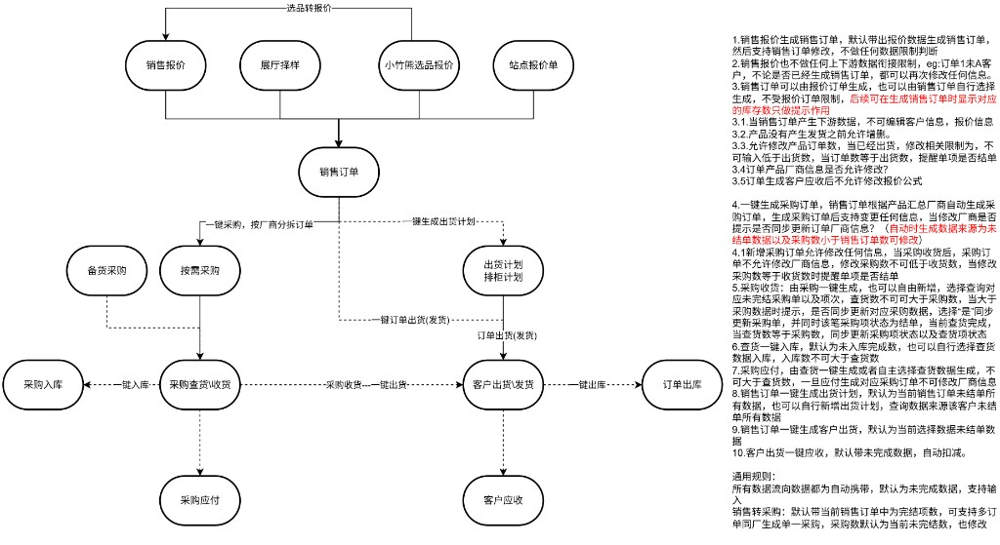

# 郭强：双引鲸单据流转与业务规则（学习用图）

## 来源说明

- **发送人**：郭强总
- **接收人**：廖送平
- **用途**：发给廖送平理解与学习（非正式已验证产品规格书；口径待与系统实操及正式资料核对）
- **入 Raw 方式**：廖送平将图片交由 Agent 落盘登记
- **入 Raw 时间**：2026-08-12

## 原始图片

## 内容概览（索引用，不替代原图）

图含两部分：

1. **左侧流程图**：选品/报价 → 销售订单 →（采购链路 + 出货链路）→ 入库/出库与应付/应收。
2. **右侧规则 1–10 + 通用规则**：各单据生成、改单、一键流转与数量/厂商锁定等约束说明。

> Raw 默认未验证，不得直接当作已验证业务事实。
